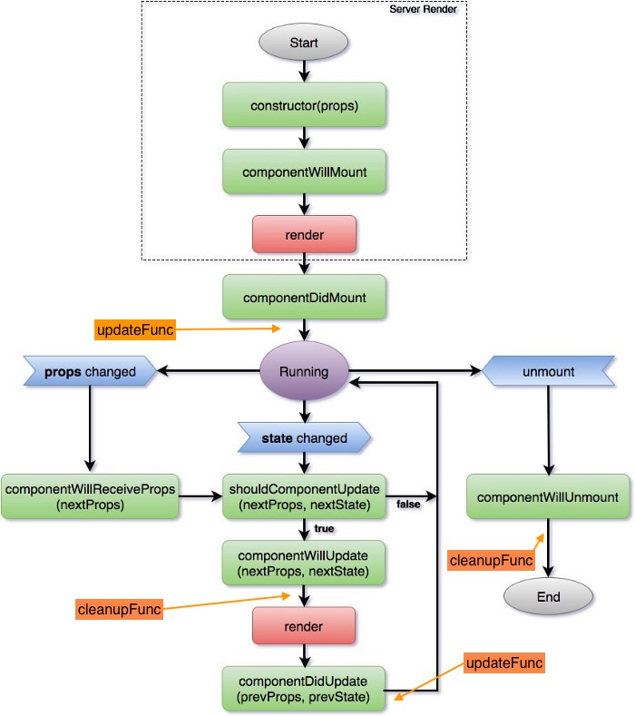
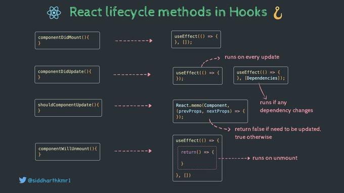

# React

[TOC]

## [Introduction](https://reactjs.org/docs/hello-world.html)

JSX est un langage transpilé en javascript (par [Babel](https://babeljs.io/)).
Il faut exporter les composants

```jsx
function Component() { ... }
export default Component;
```


On peut facilement initialiser une application react

```bash
npx create-react-app my-app
// npm install react-scripts@latest
```


### Render

C'est la fonction la plus importante, elle dit comment dessiner le composant (Nb: un composant fonction est implicitement directement la fonction `render`)

Si elle retourne `null`, alors le composant sera complètement invisible met fera malgré tout les calculs dont il a besoin.


## Lifecycle



Nb: les blocs en verts sont des functions qu'on peut surcharger dans le composant


## Composant

### Classe

```jsx
import React from 'react';

class Welcome extends React.Component {
  // On va devoir transformer les props en state:
  // les props ne seront plus disponibles dans la fonction `render`
  constructor(props) {
    super(props);
    // Don't call this.setState() here!
    this.state = { counter: 0 }; // si on fait this.setState on va tout casser
    this.handleClick = this.handleClick.bind(this);
  }
  // Function custom, Nb: elle n'est pas `bind` au composant, il faut le faire manuellement dans le constructeur
  handleClick() {
      // Do something
  }
    
  // Manage un des états
  componentDidUpdate(prevProps, prevState, snapshot) {
    // is invoked immediately after updating occurs
  }
  
  // Seule fonction obligatoire
  render() {
    return <h1>Hello, {this.props.name}</h1>;
  }
}
```

* \+ verbeux pour les cas simples
* \+ simple pour les cas complexes
  e.g. si on veut fetch des données quand le composant est créé.


### Fonctions

```jsx
import { useState, useEffect /*...*/ } from "react";

function Welcome({name, value}) {  // Nb: utilisation de la destructuration
    // Cette fonction est comme `render` avec un accès direct aux props du constructeur
    
    // Arrow function: Cela évite de devoir faire les `bind`
    const handleClick = () => {
      // Do something
  	}
    return return <button onClick={handleClick}>Hello, { name }</button>;
    
}
```

* \+ simple dans la majorité des cas et souvent mieux optimisée
* Il faut utiliser des hook `useXXX` pour compenser la gestion des lifecycles des composants classe


### useXXX: Fonction vs Classes

#### useState

Permet d'avoir un état interne qui persiste entre chaque re-render. Ca compense le `setState`

```jsx
function Welcome() {
    const [counter, setCounter] = useState(0) // prend la valeur initiale en paramètre
    const incrementCounter = () => {
      setCounter(counter + 1);  
    };
    return <button onClick={}>{counter}</div>;
    
}
```

Nb: Il ne faut **JAMAIS** modifier directement la valeur (ici `counter`). Il faut toujours:

* (idéalement) travailler sur une copie
* (obligatoire) finir la modification par assigner la valeur avec le setter (ici `setCounter`)

Quand on utilise `setCounter`, le composant entier est redessiné.
Toute valeur qui n'est **PAS** un `useState` (ou `useCallback` ou `useRef`) sera perdue

#### useRef

Comme `useState`, sauf que:

* Change la valeur ne va pas redessiner le composant
* Il n'y a donc de getter/setter mais juste 1 valeur

```jsx
const counter = useRef(0);
counter.current += 1;
```


#### useEffect (utile pour fetch des données)

Cela compense `componentDidMount`, `componentDidUpdate` et `componentWillUnmount`



```jsx
function Welcome({name}) {
    useEffect(
        // 1er paramètre: fonction a executer avant de mount le composant et après chaque update
        () => {
            // Do something after mount/update
            music.play()
            
            // On peut retourner une fonction, elle sera exécutée avant de détruire le composant
            return () => {
                music.stop()
            }
        },
        [name], // 2e paramètre: les triggers
                // (i.e. valeur qui, si modifiée, redéclenche l'appel à la fonction du 1er paramètre)
    )
    return <div>{name}</div>;
    
}
```


#### [useReducer](https://fr.reactjs.org/docs/hooks-reference.html#usereducer)  (peu utilisé)

Comme `useState` sauf que la valeur passée au setter n'est pas directement assignée mais passe d'abord dans une fonction

```jsx
const [name, setName] = useState("");
const onNameChange = (newName) => {
	setName("User: " + newName);
}
```

ici, on veut toujours que `name` commence par `User: `, donc on devrait à chaque fois recopier le code ci-dessus.

```jsx
const [name, setName] = useReducer(
	(newName) => {return `"User: ${newName}`}, // Cette fonction est appelé à chaque appel de setName
	"" // Comme useState: valeur par défaut
);
const onNameChange = (newName) => {
	setName(newName);
}
```


#### useCallback (peu utilisé: optimisation)

C'est juste pour optimiser les fonctions

```jsx
function Welcome({name, value}) {
    // Cette fonction est refaite à chaque fois que le composant est re-dessiné
    const handleClick = () => {console.log(value)}
    return return <button onClick={handleClick}>Hello, { name }</button>;
    
}
```

Pour optimiser

```jsx
function Welcome({name, value}) {
    const handleClick = useCallback(
        () => {console.log(value)},
        // 2e paramètre (optionel): trigger pour recalculer la fonction
        [value] // Cette fonction doit être recalculée si value change
  	)
    return <button onClick={handleClick}>Hello, { name }</button>;
    
}
```


## useMemo (peu utilisé: optimisation)

Quand une valeur est lourde à recalculer on veut la stocker et la recalculer que au besoin

```jsx
const heavyToCompute = useMemo(
    () => {
        /* Heavy computation*/
        // return computedValue;
   	},
    [trigger1, trigger2] // Valeur qui, si changée, doivent re-déclencher le calcul
)
```

Nb: On ne peut pas directement assigner la variable `heavyToCompute`

### createRef

Comme `useRef` mais la référence est re-créée à chaque fois.
Le but est par exemple de référencer un élément du jsx

```jsx
function Welcome({name, value}) {
    let myInput = createRef();
    const printInputValue = () => {
        /*
        	`myInput` est juste un wrapper sur la reference
        	pour obtenir la valeur interne il faut utiliser `.current`
        	ici, la valeur interne est un objet html `HTMLInputElement`,
   			  Si on veut sa valeur, on doit utiliser `.value`
        */
        console.log(myInput.current.value)
    }
    return <div>
        <button onClick={printInputValue}>print input value</button>
        <input ref={myInput}></input>
    </div>;
    
}
```

Nb: la valeur référencée ici est un [HTMLInputElement](https://developer.mozilla.org/fr/docs/Web/API/HTMLInputElement), si on veut accéder à la valeur actuelle de l'input il faut utiliser l'attribute `.value`


## Routeur

Le composant `<Routeur>` doit englober les autres composants du routeur (E.g. `<Link>`, `<Switch>`, ...) pour que ces derniers marches.
On met donc généralement le composant racine de l'application

```jsx
import React from "react";
import {
  BrowserRouter as Router,
  Switch,
  Route,
  Link,
  useRouteMatch,
  useParams
} from "react-router-dom";

// Composant racine
export default function App() {
  return (
    <Router>
      {/* Contenu réel du composant */}
      <h1> Welcome </h1>
    </Router>
  );
}
```

On peut afficher des composants différents en fonction de la route active

```jsx
function topics() {
  return <>
    <Switch>
      {/* Si un paramètre est fourni, on va appeler le composant <Topic> */}
      <Route path={`${match.path}/:topicId`}>
        <Topic />
      </Route>
      {/* Sinon on afficher le composant que l'on veut */}
      <Route path={match.path}>
        <h3>Please select a topic.</h3>
      </Route>
    </Switch>
  </>
}

// Le paramètre de route sont fournis avec useParams
function Topic() {
  let { topicId } = useParams();
  return <h3>Requested topic ID: {topicId}</h3>;
}
```


### [useNavigate](https://reactrouter.com/en/main/hooks/use-navigate) (changement de page programmatique)

```jsx
const navigate = useNavigate();
if(! isLogged) {
    // Nb: le composant va être unmount à ce moment
	navigate("/login");
}
```

Nb: On peut vouloir l'utiliser dans un `useEffect` mais ce n'est pas nécessaire.


### [useLocation](https://reactrouter.com/en/main/hooks/use-location)

permet d'accéder aux informations de l'url

### [useParams](https://reactrouter.com/en/main/hooks/use-params)

Permet d'accéder aux paramètres de la route.
=> son utilisation est donc très **contextuelle**, le composant ne pourra **PLUS** être utilisé sans le routeur

### [useQuery](https://v5.reactrouter.com/web/example/query-parameters)

Ce n'est pas une vraie fonction the react mais un outil que l'on peut se créer

```jsx
import { useLocation } from "react-router-dom";

function useQuery() {
  const { search } = useLocation();

  return React.useMemo(() => new URLSearchParams(search), [search]);
}
```

permet d'accéder au paramètre de query (ceux après le `?`)
E.g. `mysupersite.com?lotId=5`

```jsx
let query = useQuery();
let lotId = Number(query.get("lotId"))
```


### useRouteMatch

permet de créer des matchs de route

```jsx
let match = useRouteMatch();
return <Link to={`${match.url}/components`}>Components</Link>
```

Nb: `<Link>` correspond a une balise `<a>`


## Parent - Enfant "Lifting States Up" (Alternative au routeur ~)

On peut gérer un état sur le composant parent et alterner entre les enfants

```jsx
function ParentComponent() {
    const [value, setValue] = useState(true);
	if(value) {
		return <ChildA setValue={setValue}/>;
	}
    return <ChildB setValue={setValue}/>;
}
```

Nb: il faut éviter les `if` pour le rendu (lisibilité et bug) et favoriser le conditionnel dans le rendu

```jsx
function ParentComponent({value}) {
    const [value, setValue] = useState(true);
    return { cond && <ChildA  setValue={setValue}/> || <ChildB setValue={setValue}/> };
}
```

Nb: la props `children` donne accès aux composants enfants


## Context

C'est un moyen de partager des variables entre plusieurs composants

### Déclaration

```jsx
import React, { useState, createContext } from 'react';

// On déclare un context
export const UserContext = createContext();

// On déclare un composant `UserProvider` qui contient un contexte
export const UserProvider = ({ children }) => {
  const [user, setUser] = useState({ name: 'John' });
  const setName = name => setUser({ ...user, name });
  return (
    {/* On utilise le contexte UserContext et on lui passe des valeurs */}
    <UserContext.Provider value={[user, setName]}>
      {children}
    </UserContext.Provider>
  );
}
```


### Utilisation

#### Initialisation

Il faut le déclarer une fois pour que les composants enfants puissent y accèder

```jsx
return (
	<UserProvider>
    	{/* Mettre ici les enfants devant partager le context */}
    </UserProvider>
)
```

On va souvent l'initialiser autour de toute l'application

```jsx
import { UserProvider } from './context/UserContext';
const root = ReactDOM.createRoot(document.getElementById('root'));
root.render(
  <UserProvider>
    <App />
  </UserProvider>
);
```


#### Utilisation

Pour qu'un composant accède au contexte, il faut utiliser `useContext` (peu importe qu'on ait un composant de type classe ou fonction)

```jsx
import { UserContext } from './context/UserContext';
function User() {
  const value = useContext(UserContext); // c'est ce qu'on a définit dans `value=` sur le contexte
  // On peut utiliser la destructuration directement
  // const [user, setName] = useContext(UserContext);

  return ... ;
}
```


## [Redux](https://redux.js.org/api/store): React Store (variables partagées dans toute l'app)

```javascript
import { createStore } from 'redux'
const reducer = (state, action) => { // receive current state and action
    // ...
    return newState
}
const store = createStore(reducer /*, [preloadedState], [enhancer]*/)
```

* preloadedState: état initiale
* enhancer: middlewares

C'est une alternative plus simple que les contextes


Méthodes de l'objet `store`

* [`getState()`](https://redux.js.org/api/store#getstate): retourne l'état (ne doit pas être modifié directement)
* [`dispatch(action)`](https://redux.js.org/api/store#dispatchaction): envoyer une action pour modifier l'état (doit correspondre au reducer qu'on a définit)
* [`subscribe(listener)`](https://redux.js.org/api/store#subscribelistener):  le listener est une fonction qui est appelé dés qu'il y a un changement (elle ne prend aucun paramètre, **on ne sait donc pas ce qui a été modifié**).
  => très lourd, à éviter
* [`replaceReducer(nextReducer)`](https://redux.js.org/api/store#replacereducernextreducer): à éviter


# Express

## Créer un projet 

```bash
mkdir myapp && cd myapp &&  npm init --yes
```

ça va créer le strict minimum


```bash
npm install --save express body-parser cors nodemon
npm install @babel/core @babel/node @babel/preset-env
```


On peut modifier le fichier **package.json** 

```json
{
  "name": "myapp",
  "version": "1.0.0",
  "description": "",
  "main": "index.js",
  
  // Ajouter le type "module" pour utiliser les imports ES6 
  "type": "module",
  "scripts": {
    // Ajouter les 2 commandes ci-dessous
    "start": "node index.js",							// Démarrage simple
    "watch": "nodemon --exec babel-node index.js",		// Redémarrage automatique si on change un fichier
      
    "test": "echo \"Error: no test specified\" && exit 1"
  },
    
  
  "keywords": [],
  "author": "",
  "license": "ISC",
  "dependencies": {
    "@babel/core": "^7.20.12",
    "@babel/node": "^7.20.7",
    "@babel/preset-env": "^7.20.2",
    "body-parser": "^1.20.1",
    "cors": "^2.8.5",
    "express": "^4.18.2",
    "nodemon": "^2.0.20"
  }
}

```


et créer le fichier `index.js` à la racine du projet

```javascript
import express, { json } from "express";
import cors from "cors";

const app = express();
const port = 8080;

// Ajout des middlewares:
app.use(json());				// Transforme automatiquement l'output en json
app.use(cors(/*corsOptions*/))	// Autorise les CORS (pas besoin d'options dans notre cas)


app.get("/", async (req, res) => { // on reçoit la requête et la réponse en paramètre
  // ...
  res.json(data);
});

app.listen(port, () => {
  // Code a exécuter quand l'application démarre.
  console.log(`API listening on port ${port}`)
})
```


#### Alternative: Express-generator

On va utiliser [express-generator](https://expressjs.com/en/starter/generator.html) pour génerer un projet de 0

```bash
npm install -g express-generator
```

Pour créer le projet "myapp":

```bash
express myapp
```

Nb: Cela génère un projet avec les import `commonjs` au lieu d'ES6

```javascript
var express = require('express'); // au lieu de `import express from "express";`
```


## CORS

On va, en tout cas en développement, avoir 2 serveurs:

* frontend: React
  Nb: En développement, React tourne avec son propre serveur de développement, ce n'est pas express qui distribue l'application
* backend: express
